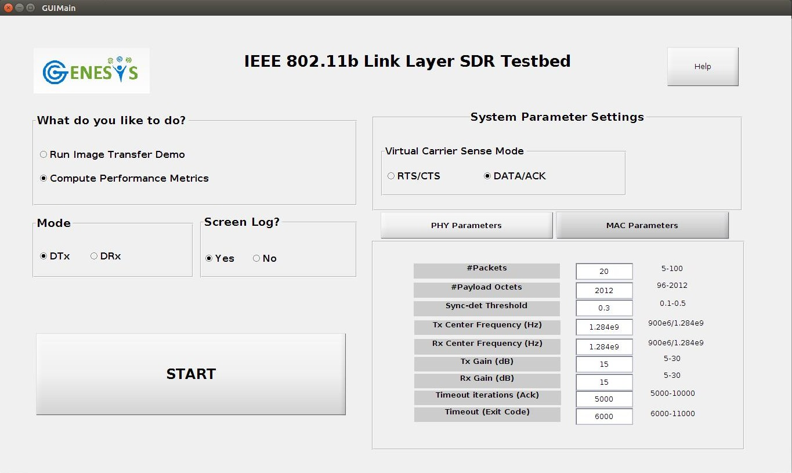
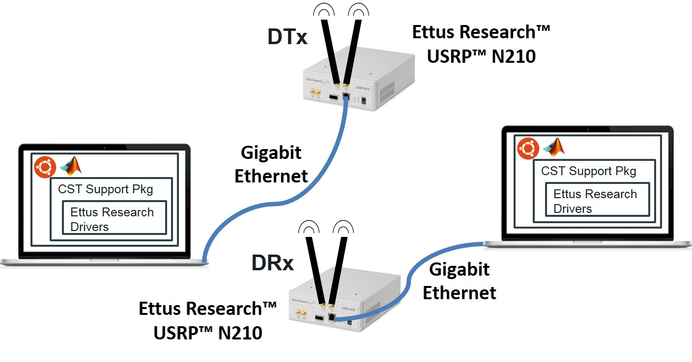

LinkLayer-MATLAB-NAV-GUI
========================================================
LinkLayer-MATLAB-NAV-GUI is a IEEE 802.11b Standard Compliant Link Layer (PHY and MAC layer) for MATLAB-based SDR. The code is highly modular and is entirely written in MATLAB. See each file for further documentation. The default settings in the files work well with our N210s using WBX daughterboards.

We model our system using a finite state machine (FSM) that transitions only on the clock cycles derived from the USRP clock, allowing for slot-time synchronized operations, thereby eliminating the need for external clocks. Futhermore, the model helps create a state-action based system design, wherein the same node switches between transmitter and receiver functions.

We adopt the IEEE 802.11b PHY and MAC layer packet structure specifications in our implementation. Our approach collects all the bits in the packet in multiples of 8 octets, which forms one USRP frame. This makes it easy for us to work with the MATLAB system objects and with PHY and MAC header fields in the DATA/ACK packet that happen to have sizes that are multiples of 8 octets. Multiple USRP frames will compose the standard-compliant 802.11b packet.

We implement **DBPSK** (differential binary phase shift keying) and **DSSS** direct sequence spread spectrum at the PHY layer and **CSMA/CA** (carrier sense multiple access with collision avoidance) at the MAC layer.

The consistent performance of the two node (1 DTx and 1 DRx; essentially a bi-directional link) and the three node (2 DTxs and 1 DRx) experimental results demonstrate the robustness of the system in mitigating packet collisions and enforcing fairness among nodes when accessing a common channel.

The current work provides a testbed to experiment with and enables creation of new MAC protocols starting from the fundamental IEEE 802.11b compliant standard.

This work is supported by **MathWorks under the Development-Collaboration Research Grant**. We would like to thank Mike McLernon and Ethem Sozer for their continued support on this project.

This code is licensed under the LGPLv3 license. Please feel free to use the code in your research and development works. We would appreciate a citation to the paper below when this code is helpful in obtaining results in your future publications. 

**Publication for citation:**<br>
Ramanathan Subramanian, Benjamin Drozdenko, Eric Doyle, Rameez Ahmed, Miriam Leeser, and Kaushik Chowdhury, "*High-Level System Design of IEEE 802.11b Standard-Compliant Link Layer for MATLAB-based SDR*", accepted on March 3rd, 2016 for publication in IEEE Access Journal.

<a href="https://youtu.be/hE3nQmGtW1E" target="_blank"></a>

## Hardware Setup


### (A) Configuring Ubuntu OS Settings & Ettus Research USRP N210 Device Setup

#### 1) Ethernet settings
**a)** Identify the **eth#** that is NOT connected to the internet.

```{eval=FALSE}
> ifconfig
```

**b)** If it is called, say, `eth1`, then change the ethernet settings on the card connected to the USRP to use a static IP address (e.g. 192.168.10.1 for DTx, or 192.168.20.1 for DRx). To do this temporarily:
```{eval=FALSE}
> sudo ifconfig eth1 192.168.10.1 netmask 255.255.255.0
> ifconfig eth1
```

**c)** Confirm that eth# has changed appropriately<br>
**Note**: By default, `dhclient` will be running for your the ethernet configuration, so, eventually this setting will be overwritten, unless you make a permanent change to the **/etc/network/interfaces** file. To do this permanently: 
```{eval=FALSE}
> cd /etc/network
> sudo chmod 777 interfaces
> vi interfaces
```

**d)** Append the following lines to the end of the file: 
```{eval=FALSE}
 #USRP configuration
 auto eth1
 iface eth1 inet static
    address   192.168.10.1
    netmask   255.255.255.0
    network   192.168.10.0
    broadcast 192.168.10.255 
```
Then, logout and log back in.

#### 2) Max. OS send/receive buffer size
**a)** Set the max. OS send buffer size (wmem) and receive buffer size (rmem) for queues on all protocols.
To do this temporarily: 
```{eval=FALSE}
> sudo sysctl -w net.core.wmem_max=1048576
> sudo sysctl -w net.core.rmem_max=50000000
```

**b)** Note that, by default, these changes will be overwritten the next time you logout and log back into your Ubuntu machine, unless you make a permanent change to the /etc/sysctl.conf file. 
To do this permanently: 
```{eval=FALSE}
> cd /etc
> sudo chmod 777 sysctl.conf
> vi sysctl.conf
```

**c)** Append the following lines to the end of the file:
```{eval=FALSE}
net.core.wmem_max=1048576
net.core.rmem_max=50000000
```
  
Then, logout and log back in. 

#### 3) Thread Priority
**a)** Set the maximum real-time priority for the "usrp" group and your user name.  This action gives our transmitter-receiver routines a high thread scheduling priority, so that they won't be preempted by other threads.
To do this permanently: 
```{eval=FALSE}
> cd /etc/security
> sudo chmod 777 limits.conf
> vi limits.conf
```

**b)** Append the following lines to the end of the file (**before "# End of file"**): 
```{eval=FALSE}
 @usrp  -    rtprio    50
 ram    -    rtprio    50
```
where, in place of "ram", you put your Unix login name. 

### (B) MATLAB R2015b Communications System Toolbox USRP Support Package Setup
#### 1) Where to install the USRP support package?
In reality, the USRP support package can be installed in any directory with write permissions on any machine. The reason we decided to install only in the **"/usr/local/MATLAB/2014b/`SupportPackages`"** directory is because of the following:<br>
**a.** We need to choose a directory for the USRP support package to be installed in that is the same on all the Ubuntu machines. This way, any MEX files we create, which have the *usrproot* install folder hard-coded within them, can reference the USRP support package shared libraries in the same location on any lab machine.<br>
**b.** This directory must be accessible by all User accounts that need to run the USRP Support Package (sdru) System objects and transceive functions. That's why the install directory cannot be in the default /home/<userName>, since permissions in any home directory are always set to only allow a specific user to access his own files.

#### 2) USRP Support Package Installation Steps:
**a)** Start the GUI wizard by typing the **supportPackageInstaller** command in MATLAB. Download the USRP support package `usrpradio_download` to a folder, e.g. **/home/ram/Documents/MATLAB/SupportPackages/R2015b/downloads**, where, in place of "ram", you put your Unix login name.<br>
**b)** Move this `usrpradio_download` directory to under **/usr/local/MATLAB/R2015b/SupportPackages/downloads/**<br>
**c)** Install the USRP support package from the above folder by now picking the 'Install from folder' option in the GUI wizard. You might be prompted to login to your MathWorks account.<br>
**d)** Make sure to add all the Support Package folders on MATLAB path. 
Use *Set Path* from the MATLAB tool tab menu to add path **/usr/local/MATLAB/R2015b/toolbox/shared/hwconnectinstaller**.

#### 3) Setting the default MATLAB startup directory using Ubuntu OS  (strictly optional)
Automatically setting the working directory, to say **/usr/local/MATLAB/DTx**, every time we start MATLAB is convenient as you don't have to do this yourself.  To enact this, you could do the following steps:<br> 
**a)** Open up a new Unix terminal and go to your home directory:<br>
```{eval=FALSE}
> cd ~
```

**b)** Edit the files `.profile` and `.bashrc` to append the following line at the very end of each file:
```{eval=FALSE}
export MATLAB_USE_USERWORK=1
```

**c)** Ensure that the shared work directory **/usr/local/MATLAB/DTx** exists on this machine.  If it doesn't, then create it.
```{eval=FALSE}
> cd /usr/local/MATLAB
> ls
> mkdir DTx
> chmod 777 DTx
```

**d)** Start MATLAB R2015b
```{eval=FALSE}
> matlab
```

**e)** At the command prompt, run the `userpath` function to change your starting directory:
```{eval=FALSE}
>> userpath('/usr/local/MATLAB/V40');
>> u=userpath
>> cd(u(1:end-1));
```

**f)** Close MATLAB and restart your computer using Ubuntu OS. Restart MATLAB and verify that it starts in the shared work directory.

#### You are now ready to run the scripts!
Start with generating the MEX-file for *transceive* function at DTx and the DRx. To generate the MEX function `transceiveXXX_mex()` from `transceiveXXX()`, execute the `DTxInitParameters.m`/`DRxInitParameters.m` script to load onto workspace the values of the relevant variables and then, use the `codegen` as shown below,<br>
**Note**: `XXX` is the last three digits in the IP address of the corresponding USRP node. For e.g., the node set to IP address, say, **192.168.10.1** will have `XXX` equated to `101`. At the DTx, the `transceiveXXX()` includes a `swapFreqFlag`, set to **0** by default. By setting it to **1**, the center frequency of the transceiver's Tx and Rx operates in different channels. Essentially, the DTx *listens* for activity in the **same channel** it will soon *transmit* the DATA packet from, and switches to a **different channel** when it starts *receiving* the ACK. We recommend the different channels be separated by an amount greater than the bandwidth of the system, i.e. 1 MHz.<br>
At the DTx,
```{eval=FALSE}
>> DTxInitParameters
>> swapFreqFlag = 0; %same channel operation
>> codegen transceiveXXX -args {complex(zeros(1408,1)),true,txGain,rxGain,centerFreqTx,centerFreqRx,decFactor, intFactor,swapFreqFlag}
```
At the DRx,
```{eval=FALSE}
>> DRxInitParameters
>> codegen transceiveXXX -args {complex(zeros(1408,1)),true,txGain,rxGain,centerFreqTx,centerFreqRx,decFactor, intFactor}
```

### Running the Two Node (1 DTx and 1 DRx) OR the Three Node (2 DTxs and 1 DRx) System with GUI
Run `GUIMain.m` script in MATLAB to invoke an interactive Graphical User Interface (GUI). The GUI helps the user set the required parameters as desired to conduct over-the-air experiments. Default settings for PHY/MAC parameters are given in bubble choices and in edit text boxes. Once the parameters are set, press the `START` button to run the experiments. Press `HELP` button for guidance with parameters selection and running the experiment. 

